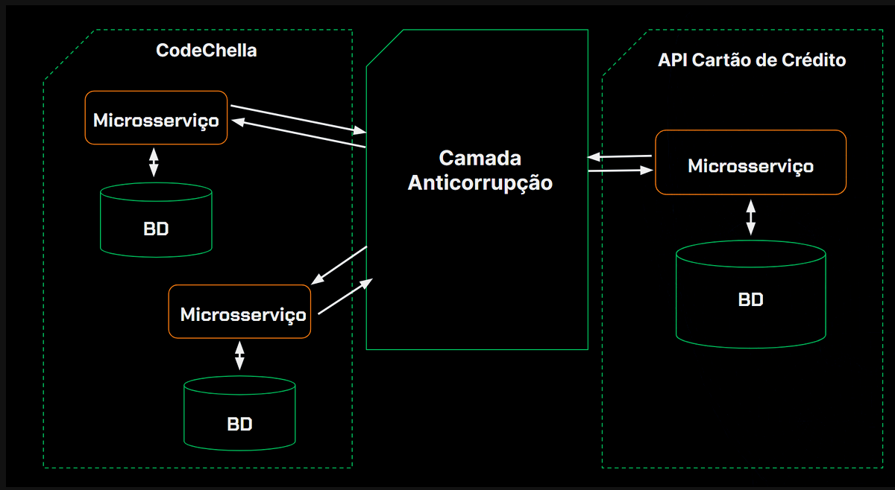

# CodeChella

App de simulação de um site para venda de ingressos de eventos diversos

## 🔨 Objetivos do projeto

- Aplicar as técnicas do desenvolvimento orientado ao domínio;
- Criar software que realmente entregue valor ao cliente;
- Entender sobre subdomínios, contextos delimitados e contextos compartilhados;
- Aprender sobre os blocos de construção (Entidades, Objetos de valor, Agregados);
- Conhecer as vantagens da utilização de camadas anticorrupção.

## Entidades de domńio

As regras de negócio deve estar dentro das entidades de domínio

## Subdominio e contextos limitados


### Como fazer para separar os contextos?


### Separando os domínios


# Designer Tático no Domain-Driven Design (DDD)

No contexto do Domain-Driven Design (DDD), o **Designer Tático** é responsável por aplicar práticas e padrões
específicos para modelar e implementar o domínio de uma aplicação de forma eficiente. Este papel é fundamental para
transformar conceitos teóricos em soluções práticas e robustas, garantindo que a arquitetura de software suporte o
modelo de domínio.

## Funções e Responsabilidades

O Designer Tático trabalha com os seguintes elementos do DDD:

### 1. Entidades

Objetos que possuem uma identidade distinta e persistente ao longo do tempo. Eles são utilizados para representar
conceitos do domínio que têm uma identidade única e contínua.

### 2. Value Objects

Objetos que representam um conceito ou uma medida, mas que não possuem uma identidade própria. Eles são definidos apenas
pelos seus atributos e são imutáveis. Um value object serve para complementar as informações para uma entidade

### 3. Agregados

Conjuntos de entidades e value objects que são tratados como uma unidade coesa para garantir a consistência do modelo de
domínio. O agregado define limites claros e regras de consistência para o grupo de objetos.

### 4. Repositórios

Interfaces que fornecem métodos para acessar e armazenar agregados. Os repositórios abstraem a camada de persistência,
permitindo operações de criação, leitura, atualização e exclusão.

### 5. Serviços de Domínio

Operações ou lógicas de negócios que não pertencem a uma entidade ou value object específico. Esses serviços encapsulam
regras e processos importantes do domínio.

### 6. Fábricas (facture)

Classes ou métodos responsáveis por criar instâncias de agregados e outras entidades. As fábricas garantem que a criação
de objetos complexos seja feita de maneira consistente e controlada.

## Objetivo

O objetivo do Designer Tático é garantir que a implementação técnica do sistema esteja alinhada com o modelo de domínio
e os princípios do DDD. Isso envolve trabalhar com mapeamento objeto-relacional (ORM), camadas de aplicação, e
interfaces, garantindo que o design do sistema suporte efetivamente as necessidades do negócio.

# Exemplos de agregados

```java

@Getter
public class Evento {

    private UUID uuid;
    private Categoria categoria;

    private String descricao;

    private LocalDateTime dataCadastro;

    private Endereco endereco;
    //Agregado de evento
    private List<TipoIngresso> tipoIngressos = new ArrayList<>();

```

## Camada antcorrupção (Anticorruption Layer, ou ACL)

É um padrão arquitetural usado para proteger o modelo de domínio de um sistema contra a influência indesejada de
sistemas externos ou de outros subsistemas com modelos de domínio diferentes.



### Objetivo da Camada de Anticorrupção

O principal objetivo da camada de anticorrupção é evitar que o modelo de domínio interno seja "corrompido" ou
contaminado por conceitos e terminologias de sistemas externos, garantindo que o modelo de domínio permaneça
consistente, coeso e alinhado com as regras de negócio específicas do sistema.

## Contextos compartilhados (Shared Kernel)

xxxxxxxxxxxxxxxxxxxxxxxxxxxxxxxxxxxxxxxx


## Domain-Driven Design (DDD) vs Clean Architecture

Domain-Driven Design (DDD) e Clean Architecture são abordagens arquiteturais usadas no desenvolvimento de software, mas
elas têm focos e objetivos diferentes, embora possam ser complementares. Aqui está um resumo das principais diferenças:

### 1. Foco e Objetivo

**Domain-Driven Design (DDD):**

- **Foco:** O principal foco de DDD é modelar o domínio do negócio de forma precisa e eficaz, usando uma linguagem comum
  entre desenvolvedores e especialistas do domínio. DDD concentra-se em capturar a complexidade do domínio e refletir
  essa complexidade no código.
- **Objetivo:** Facilitar a comunicação entre as partes interessadas e garantir que o software esteja alinhado com as
  regras e processos do negócio. O objetivo é criar um modelo de domínio que reflita com precisão a realidade do
  negócio.

**Clean Architecture:**

- **Foco:** Clean Architecture é uma abordagem de arquitetura que visa criar sistemas modulares, independentes de
  frameworks, de interfaces de usuário, de bancos de dados e de outras preocupações externas. Ela se concentra em
  estruturar o código de maneira que as dependências entre os componentes sigam o princípio da inversão de dependência.
- **Objetivo:** Criar sistemas que sejam facilmente mantidos, testáveis e adaptáveis a mudanças. O objetivo é garantir
  que as regras de negócio (ou domínio) sejam independentes de detalhes técnicos e que o sistema possa evoluir sem que
  as mudanças em uma camada afetem negativamente outras.

### 2. Camadas e Organização

**Domain-Driven Design (DDD):**

- **Camadas:** Em DDD, a organização pode seguir as camadas clássicas, como Aplicação, Domínio, Infraestrutura, etc.,
  mas o foco está em organizar o código em torno de contextos delimitados (Bounded Contexts). Dentro de cada contexto
  delimitado, o código é estruturado em Entidades, Objetos de Valor, Serviços de Domínio, Repositórios, etc.
- **Modelo de Domínio:** DDD coloca o modelo de domínio no centro da arquitetura, enfatizando a necessidade de que todas
  as camadas respeitem esse modelo.

**Clean Architecture:**

- **Camadas:** Clean Architecture define uma série de camadas concêntricas, onde cada camada depende apenas das camadas
  mais internas. As camadas típicas incluem:
    - **Entidades:** Modelam as regras de negócio do domínio.
    - **Casos de Uso (Use Cases):** Contêm a lógica de aplicação e coordenam as interações entre as entidades.
    - **Interface de Aplicação:** Contém as interfaces e adaptadores que interagem com o mundo externo, como bancos de
      dados, UI, APIs, etc.
    - **Frameworks e Drivers:** Camada mais externa que implementa detalhes técnicos, como bancos de dados ou interfaces
      de usuário.
- **Independência:** Clean Architecture se preocupa com a independência das camadas em relação às outras, especialmente
  das regras de negócio em relação a detalhes técnicos.

### 3. Independência e Flexibilidade

**Domain-Driven Design (DDD):**

- **Independência:** DDD valoriza a independência do modelo de domínio, mas a abordagem não impõe uma separação rígida
  entre camadas. O foco é mais na integridade do modelo de domínio do que na independência técnica.
- **Flexibilidade:** A flexibilidade em DDD vem da capacidade de adaptar o modelo de domínio às mudanças no negócio,
  mantendo o código alinhado com o entendimento do domínio.

**Clean Architecture:**

- **Independência:** A independência entre camadas é um dos princípios centrais da Clean Architecture. As camadas
  internas não dependem das externas, e isso permite maior flexibilidade na substituição ou modificação das camadas
  externas sem impactar as regras de negócio.
- **Flexibilidade:** Clean Architecture facilita a evolução do sistema, permitindo que mudanças em detalhes técnicos (
  como frameworks ou interfaces de usuário) sejam feitas sem afetar o núcleo de regras de negócio.

### 4. Complementaridade

**Complementaridade:**

- DDD e Clean Architecture não são mutuamente exclusivos. Na verdade, eles podem ser usados juntos. Você pode usar DDD
  para modelar seu domínio de negócio e, ao mesmo tempo, aplicar os princípios de Clean Architecture para garantir que
  seu código seja modular e que as camadas do sistema sejam independentes.
- Por exemplo, o modelo de domínio construído com DDD pode ser colocado na camada mais interna (Entidades) de uma Clean
  Architecture, enquanto os casos de uso DDD podem residir na camada de Casos de Uso.


