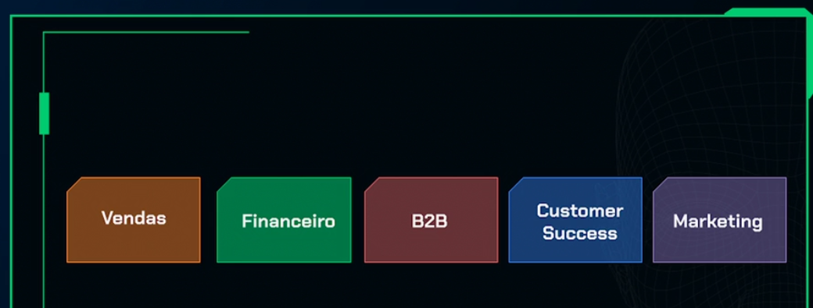
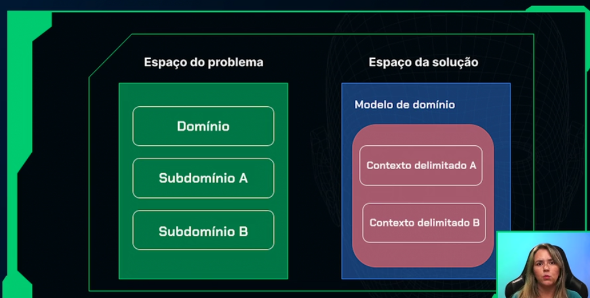
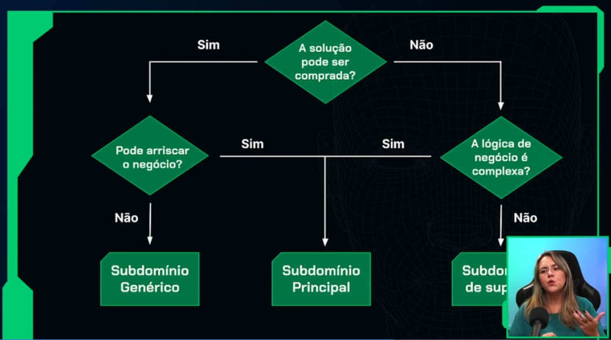

# CodeChella

App de simulação de um site para venda de ingressos de eventos diversos

## 🔨 Objetivos do projeto

- Aplicar as técnicas do desenvolvimento orientado ao domínio;
- Criar software que realmente entregue valor ao cliente;
- Entender sobre subdomínios, contextos delimitados e contextos compartilhados;
- Aprender sobre os blocos de construção (Entidades, Objetos de valor, Agregados);
- Conhecer as vantagens da utilização de camadas anticorrupção.

## Entidades de domńio

As regras de negócio deve estar dentro das entidades de domínio

## Subdominio e contextos limitados



### Como fazer para separar os contextos?



### Separando os domínios



# Designer Tático no Domain-Driven Design (DDD)

No contexto do Domain-Driven Design (DDD), o **Designer Tático** é responsável por aplicar práticas e padrões
específicos para modelar e implementar o domínio de uma aplicação de forma eficiente. Este papel é fundamental para
transformar conceitos teóricos em soluções práticas e robustas, garantindo que a arquitetura de software suporte o
modelo de domínio.

## Funções e Responsabilidades

O Designer Tático trabalha com os seguintes elementos do DDD:

### 1. Entidades

Objetos que possuem uma identidade distinta e persistente ao longo do tempo. Eles são utilizados para representar
conceitos do domínio que têm uma identidade única e contínua.

### 2. Value Objects

Objetos que representam um conceito ou uma medida, mas que não possuem uma identidade própria. Eles são definidos apenas
pelos seus atributos e são imutáveis. Um value object serve para complementar as informações para uma entidade

### 3. Agregados

Conjuntos de entidades e value objects que são tratados como uma unidade coesa para garantir a consistência do modelo de
domínio. O agregado define limites claros e regras de consistência para o grupo de objetos.

### 4. Repositórios

Interfaces que fornecem métodos para acessar e armazenar agregados. Os repositórios abstraem a camada de persistência,
permitindo operações de criação, leitura, atualização e exclusão.

### 5. Serviços de Domínio

Operações ou lógicas de negócios que não pertencem a uma entidade ou value object específico. Esses serviços encapsulam
regras e processos importantes do domínio.

### 6. Fábricas (facture)

Classes ou métodos responsáveis por criar instâncias de agregados e outras entidades. As fábricas garantem que a criação
de objetos complexos seja feita de maneira consistente e controlada.

## Objetivo

O objetivo do Designer Tático é garantir que a implementação técnica do sistema esteja alinhada com o modelo de domínio
e os princípios do DDD. Isso envolve trabalhar com mapeamento objeto-relacional (ORM), camadas de aplicação, e
interfaces, garantindo que o design do sistema suporte efetivamente as necessidades do negócio.

# Exemplos de agregados

```java
@Getter
public class Evento {

    private UUID uuid;
    private Categoria categoria;

    private String descricao;

    private LocalDateTime dataCadastro;

    private Endereco endereco;
    //Agregado de evento
    private List<TipoIngresso> tipoIngressos = new ArrayList<>();

```# API-Domain-Driven-Design
# API-Domain-Driven-Design
# API-Domain-Driven-Design
